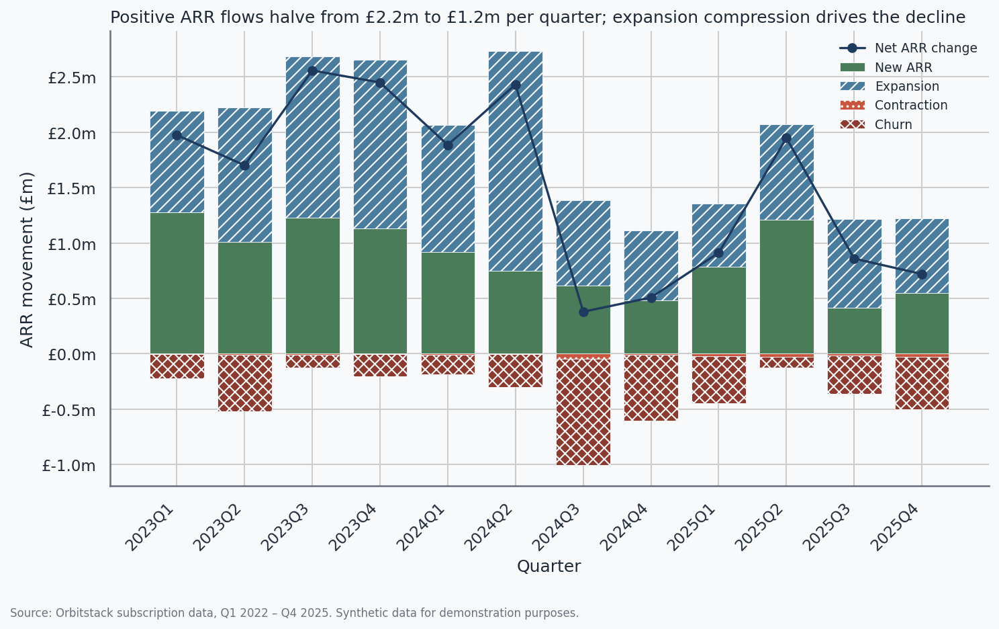

# Orbitstack NRR Decline — Commercial Diagnostic

Synthetic analysis demonstrating a 2-week commercial analytics
diagnostic for a fictional PE-backed B2B SaaS business. Not real
client data. Built in Python with Jupyter.

## Headline finding



Orbitstack's headline NRR decline (116% → 105%) is not a churn
problem. Gross Revenue Retention holds in a 92%–97% band throughout
the 12 quarters. The decline is driven by expansion collapse,
concentrated in the mid-market segment (50–250 employee customers)
and temporally aligned with the launch of a competitor, FleetLogic,
in mid-2024. Enterprise NRR remains healthy at ~110%.

## Scenario

Orbitstack is a PE-backed B2B SaaS business providing workflow
automation to mid-market logistics firms — mid-twenties-millions ARR
as of 31 December 2025, three years into a five-year hold period
with sponsor Meridian Capital. Headline NRR has declined from 118%
in Q1 2023 to 104% in Q4 2025, and the CFO's initial view is that
this is a churn problem driven by macro pressure on logistics
customers. The sponsor has requested an independent diagnostic
ahead of a planned exit process in 18–24 months. This notebook
represents the first two weeks of the engagement — data collection,
definitional audit, decomposition, segmentation, and initial
hypothesis formation.

## How to run

```bash
git clone <repo-url>
cd orbitstack-nrr-analysis
python -m venv venv && source venv/bin/activate
pip install -r requirements.txt
make all
jupyter notebook notebook.ipynb
```

## Repository structure

```
orbitstack-nrr-analysis/
├── README.md
├── LICENSE
├── requirements.txt
├── run.sh
├── Makefile
├── notebook.ipynb
├── .gitignore
├── data/
│   ├── generate_data.py
│   ├── customers.csv            # Generated
│   ├── subscriptions.csv        # Generated
│   └── churn_reasons.csv        # Generated
└── outputs/
    └── figures/
        ├── 04_acquisition_by_segment.png
        ├── 05_headline_nrr_decline.png
        ├── 06_nrr_decomposition.png
        ├── 06_nrr_vs_grr.png
        ├── 07_segment_nrr_trends.png
        ├── 08_cohort_triangle.png
        ├── 09_churn_reasons.png
        └── 10_expansion_trajectory.png
```

## Notes on production implementation

In a real engagement, the transformation logic in this notebook would
live in dbt marts models against a warehouse (Snowflake, BigQuery, or
similar), with visualisations served through Looker, Preset, or
equivalent. The notebook represents the analytical reasoning; the
production stack would be the delivery layer for ongoing reporting.

The synthetic data generator (`data/generate_data.py`) uses a fixed
seed (42) for byte-level reproducibility. All ARR movements reconcile
exactly to period starting and ending balances; assertions are
included in section 6 of the notebook.

## Methodology notes

- **Snapshot date:** 31 December 2025
- **Analysis period:** Q1 2023 – Q4 2025 (12 quarters)
- **NRR definition:** dollar-based, trailing 12 months, excluding new
  logos acquired in the analysis period
- **Cohorts:** customer cohort = calendar quarter of first paid
  invoice date
- **Currency:** all GBP, no FX modelled
- **Re-activations:** excluded (none present in synthetic data)

For full methodology, see Appendix A of the notebook.
